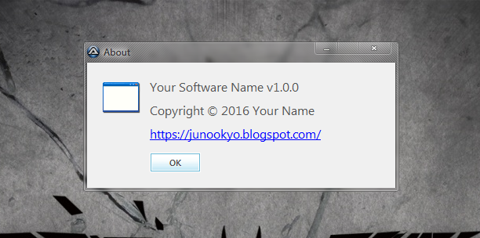

# AutoIt About UDF
This UDF is an easy way to create the About dialog for your application

## Screenshot



## Example

```
#NoTrayIcon

#include "about.au3"

_showAboutDialog('Your Software Name', '1.0.0', 'Your Name', Default, Default, 'https://junookyo.blogspot.com/')
```
